
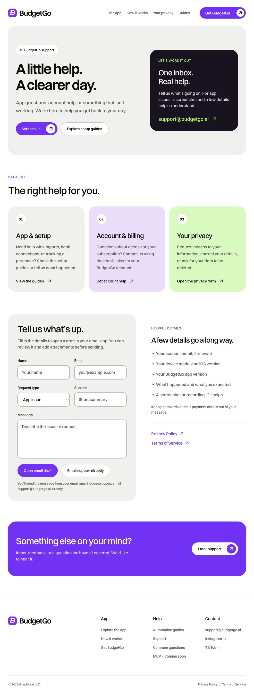
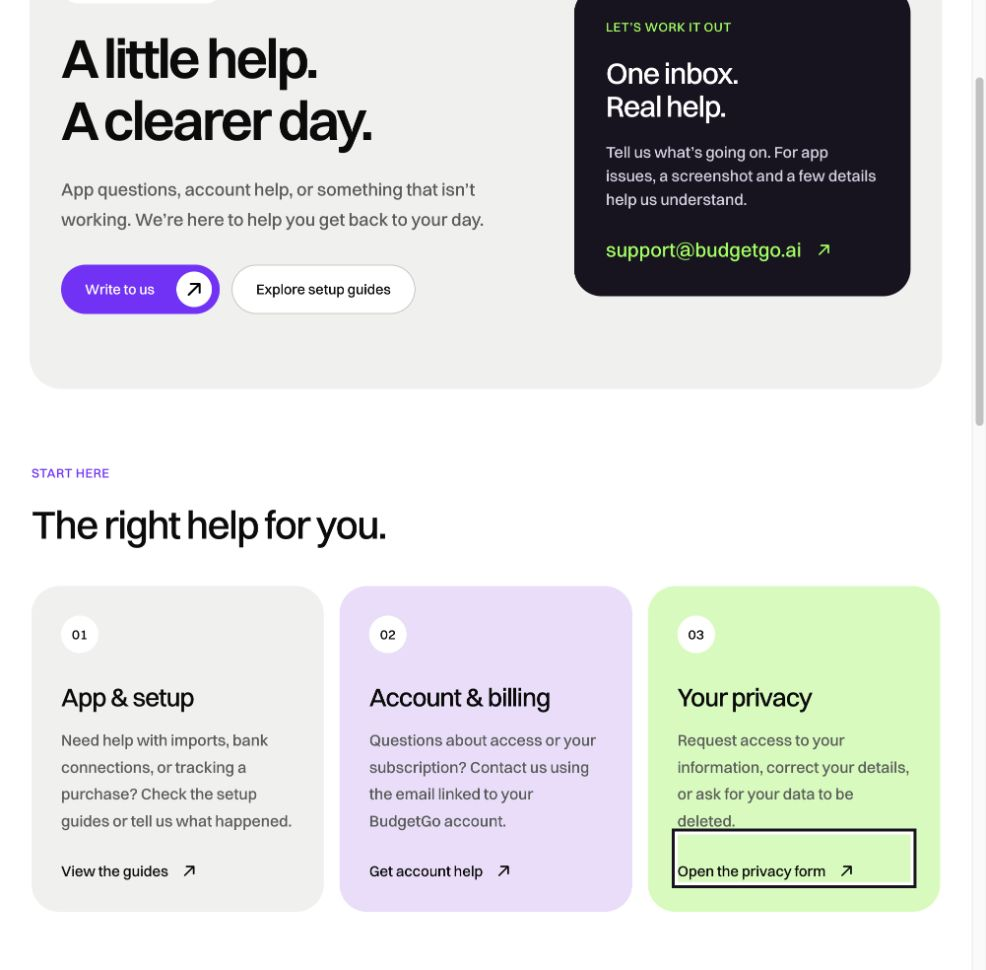
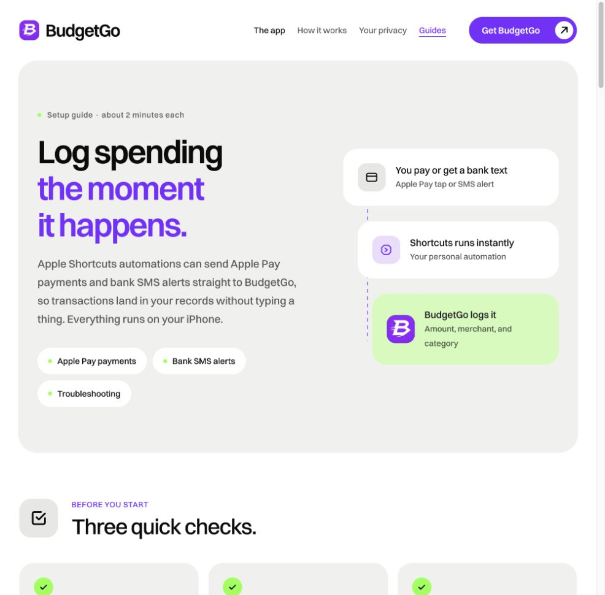
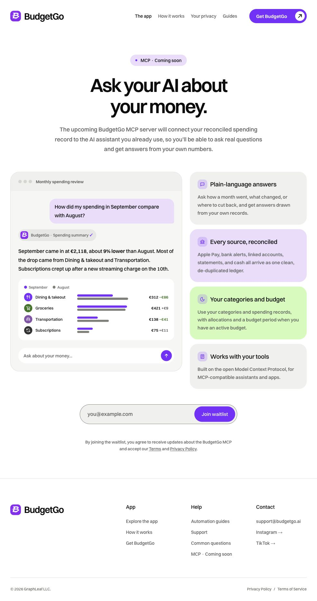
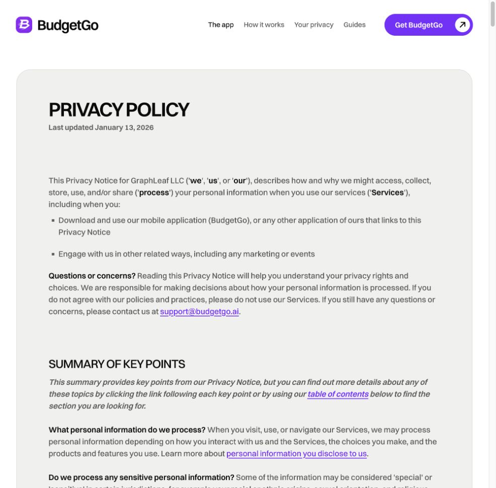
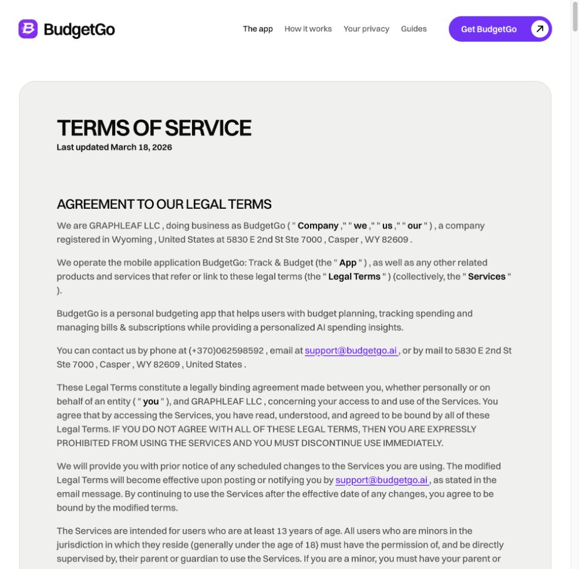

# BudgetGo color review

Reviewed October 2, 2026. Scope: six public pages, palette consistency, text/chart contrast, field boundaries, and visible focus. Existing layouts and content were preserved.

## Color direction

Use purple for primary actions and brand emphasis; lime for accents; white/off-white for reading surfaces; black for text and dark sections. Use dark lime on white and lighter purple on black when brighter brand colors lack contrast. This is the design recommendation for BudgetGo, rather than a universal rule about color psychology.

W3C guidance requires [4.5:1 text contrast, or 3:1 for large text](https://www.w3.org/WAI/WCAG22/Understanding/contrast-minimum.html), [3:1 for essential control and graphic details](https://www.w3.org/WAI/WCAG22/Understanding/non-text-contrast.html), and [information beyond color alone](https://www.w3.org/WAI/WCAG22/Understanding/use-of-color.html).

## Pages reviewed

1. Homepage — palette aligned; improved source labels, chart colors, and insight hints.
2. Support — palette aligned; clearer form boundaries and shared muted text.
3. Automation guides — palette aligned; darker shared text and an underlined current navigation item.
4. MCP — improved chart contrast, consistent purple current-period bars, darker previous-period bars, and clearer waitlist boundary.
5. Privacy policy — purple underlined links now include nested text; shared muted text resolves correctly.
6. Terms of service — same legal link and text improvements.

## Key corrections

| Element | Before | After |
| --- | --- | --- |
| Muted text on pale purple | 4.49:1 | Darker shared neutral `#595c59` |
| Source footnote on lavender | 4.01:1 | Darker purple-grey `#70627e` |
| Source numbers | 3.10:1 | Darker shared neutral |
| Support field border against white | 1.70:1 | 3.97:1 (`#80807a`) |
| Weekly chart bars on lavender | 1.43:1 | Darker purple `#8055a6` |
| Insight hint on purple | Faded text | 6.04:1 without opacity |

Keyboard focus uses a black outline with a white inner ring. Navigation states and legal links retain underlines so their meaning does not depend only on color. Chart colors and their keys match.

## Evidence

Before screenshots are saved beside this report with the `before` suffix. These accepted after screenshots were captured from the local site through computer use:

### 1. Homepage

### 2. Support

### 3. Automation guides

### 4. MCP

### 5. Privacy policy

### 6. Terms of service

## Limits

This is a focused color review, not a full accessibility certification. Screenshots cover the desktop pages; the long guide capture has a height limit, and final guide/legal captures show their opening sections. Existing photography, third-party screenshots, forms, and animation behavior were not redesigned. No tests were added or run. The user's running server and browser sessions were preserved.
